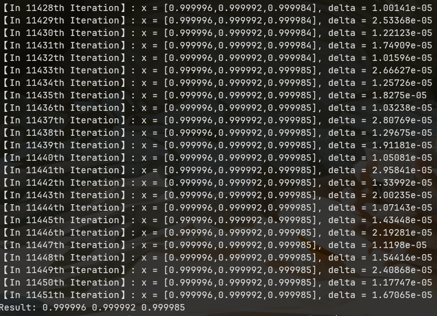

##HW1:Linear-search Steepest Gradient Descent
### Dependency
gcc >= 9.0
GUN Make >= 4.0
### How to run
```shell
cd HW_1
make all
./main_node
make clean 
``` 
### Workflow
实现任意维度Rosenbrock问题的最小值求解，在 main_node.cc 定义问题的维数，默认initial guess为[0,...,0]。接着实例化一个GradientDescentSolver对象，参数包括初始值x0,最大迭代次数，Amijo Condition系数c。最后调用solver.Solve()进行求解。

```cpp
int main(int argc, char const *argv[])
{

    std::vector<double> x0;

    int dimensions = 3;
    for (int i = 0; i < dimensions; ++i) {
        x0.push_back(0.0);
    }

    GradientDescentSolver solver(x0, 100000, 1e-4);

    auto result = solver.Solve();

    Logger().LOG(result);

    return 0;
}
```
### Result
一个三维Rosenbrock问题求解示例：
