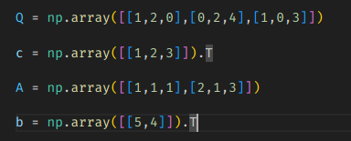
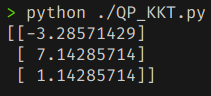
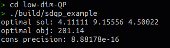
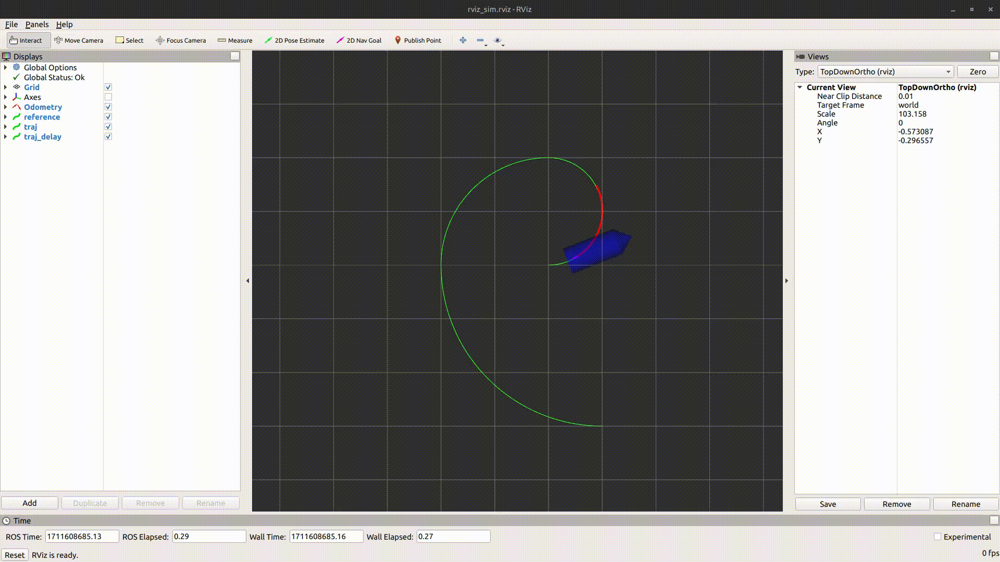

##  Task 1

带等式约束的QP问题：
$$
\min_{x} \frac{1}{2} x^{T}Qx+c^{T}x \\
 s.t. Ax=b
$$
拉格朗日函数：
$$
\mathcal{L} (x,\lambda )=\frac{1}{2} x^{T}Qx+c^{T}x+\lambda ^{T}(Ax-b)
$$
KKT condition：
$$
\nabla_{x}\mathcal{L} (x,\lambda )=Qx+c+A^{T}\lambda =0 \\
Ax - b = 0
$$
KKT system:
$$
\begin{bmatrix}
 Q &A^{T} \\
 A  & 0
\end{bmatrix}
\begin{bmatrix}
 x^{*}\\
\lambda^{*}
\end{bmatrix}
=
\begin{bmatrix}
 -c\\
b
\end{bmatrix}
$$

$$
\begin{bmatrix}
 x^{*}\\
\lambda^{*}
\end{bmatrix}
=
\begin{bmatrix}
 Q &A^{T} \\
 A  & 0
\end{bmatrix}^{-1}
\begin{bmatrix}
 -c\\
b
\end{bmatrix}
$$

###  Result





##  Task 2

1. 利用当前active 的halfspace的法向量g(`plane_i`)，计算出反射向量u(`reflx`)
   $$
   u=g+sgn(g_{i})*\left \| g \right \| * e_{i} \\
   \text{where } i = argmax_{k}\left | g_{k} \right |
   $$

2. 利用反射向量u，求Householder reflection矩阵H
   $$
   H=I_{d}-\frac{2uu^{T}}{u^{T}u}
   $$

3. d维向量向d-1维投影
   $$
   \text{projh}= H * h \\
    \text{rid of i th row in 1.}
   $$

```cpp
				// Calculate Orth. Basis M
                // M are (d - 1) row vectors of H without id-th
                // H = Id - 2 * u ^ uT / uT ^ u
                // plane_i[0 - d-1] = reflx == g
                // reflx == u = g - sign(g_id) * g_norm * e_id
                const int id = max_abs<d>(plane_i);
                cpy<d>(plane_i, reflx);
                double reflx_norm = std::sqrt(sqr_norm<d>(reflx));
                reflx[id] = reflx[id] + copysign(reflx_norm, reflx[id]);

                // Project half space from【d】dim to【d - 1】dim
                // halfspace =>【d】dim + 1
                // proj_halfspace =>【d - 1】dim + 1
                // new_h = h - p1 * u * uT * h
                //       = h - p1 * p2 * u [without id-th]
                const double p1 = 2.0 / sqr_norm<d>(reflx);
                auto project = [&](const double *halfspace, double *proj_halfspace) -> void
                {
                    const double p2 = dot<d>(reflx, halfspace);
                    int t = 0;
                    for (int k = 0; k < d + 1; ++k)
                    {
                        if (k == id)
                        {
                            continue;
                        }
                        proj_halfspace[t++] = halfspace[k] - p1 * p2 * reflx[k];
                    }
                    proj_halfspace[d - 1] = dot<d>(new_origin, halfspace) + halfspace[d];
                };

                for (int j = 0; j != i; j = next[j])
                {
                    const double *halfspace = halves + (d + 1) * j;
                    double *proj_halfspace = new_halves + d * j;
                    project(halfspace, proj_halfspace);
                }
```

###  result



##  Task 3

PHR-ALM 分为三个部分

```cpp
				// PHR-ALM main loop
                while ((cons_residual >= cons_eps || prec_residual >= prec_eps) && iterations <= max_iterations)
                {
                    // Get optimal control sequence x
                    Calculate_Optimal_Control_Sequence();

                    // Update dual variables ALM_mu_
                    Update_Dual_Variables_And_Residual();

                    // Update penalty weight ALM_rho_
                    Update_Penalty_Weight();

                    iterations++;
                }
```

1. 利用L-BFGS解无约束优化问题，求最优控制序列

   ```c++
   				auto Calculate_Optimal_Control_Sequence = [&]() -> void
                   {
                       lbfgs::lbfgs_parameter_t lbfgs_params;
                       lbfgs::lbfgs_load_default_parameters(&lbfgs_params);
                       lbfgs_params.mem_size = 16;
                       lbfgs_params.past = 3;
                       lbfgs_params.g_epsilon = 0.0;
                       lbfgs_params.min_step = 1e-32;
                       lbfgs_params.delta = 1e-4;
                       lbfgs_params.line_search_type = 0;
                       double minObjective;
                       ret = lbfgs::lbfgs_optimize(m * N_, x, &minObjective, &ALObjectiveFunc, 
                                                   nullptr, nullptr, this, &lbfgs_params);
                       lbfgs_params.g_epsilon = std::max(lbfgs_params.g_epsilon * 0.1, 1e-4);
                   };
   ```

   其中ALObjectiveFunc函数如下：

   ```c++
           static inline double ALObjectiveFunc(void *ptrObj,
                                                const double *x,
                                                double *grad,
                                                const int n)
           {
               MpcCar &obj = *(MpcCar *)ptrObj;
               Eigen::Map<const Eigen::MatrixXd> inputs(x, m, obj.N_);
               Eigen::Map<Eigen::MatrixXd> grad_inputs(grad, m, obj.N_);
   
               // forward propogate
               std::vector<VectorX> states(obj.N_ + 1);
               states[0] = obj.x0_observe_;
               VectorX xk_1 = obj.x0_observe_;
               for (int i = 0; i < obj.N_; ++i)
               {
                   obj.forward(states[i], inputs.col(i), xk_1);
                   states[i + 1] = xk_1;
               }
               // cost and gradient of states
               double total_cost = 0;
               VectorX grad_xk, grad_xk_1;
               VectorU grad_uk;
               grad_xk.setZero();
               for (int i = obj.N_ - 1; i >= 0; i--)
               {
                   total_cost += obj.al_stage_cost_gradient(i, states[i + 1], grad_xk_1);
                   grad_xk_1 = grad_xk_1 + grad_xk;
                   obj.backward(states[i], inputs.col(i), grad_xk_1, grad_xk, grad_uk);
                   grad_inputs.col(i) = grad_uk;
               }
               // cost and gradient of inputs
               for (int i = 0; i < obj.N_; ++i)
               {
                   double a = inputs.col(i)(0);
                   double delta = inputs.col(i)(1);
                   double grad_a, grad_delta;
                   total_cost += obj.al_box_constrant(a, -obj.a_max_, obj.a_max_, i, 0, grad_a);
                   grad_inputs.col(i)(0) += grad_a;
                   total_cost += obj.al_box_constrant(delta, -obj.delta_max_, obj.delta_max_, i, 1, grad_delta);
                   grad_inputs.col(i)(1) += grad_delta;
               }
               for (int i = 0; i < obj.N_ - 1; ++i)
               {
                   double delta_k = inputs.col(i)(1);
                   double delta_k_1 = inputs.col(i + 1)(1);
                   double ddelta = delta_k_1 - delta_k;
                   double grad_ddelta;
                   total_cost += obj.al_box_constrant(ddelta, -obj.ddelta_max_ * obj.dt_, obj.ddelta_max_ * obj.dt_,
                                                      i, 3, grad_ddelta);
                   grad_inputs.col(i)(1) -= grad_ddelta;
                   grad_inputs.col(i + 1)(1) += grad_ddelta;
               }
               return total_cost;
           }
   ```

   al_stage_cost_gradient：

   ```c++
   		double al_stage_cost_gradient(const int &k,
                                         const VectorX &x,
                                         VectorX &grad_x)
           {
               const Eigen::Vector3d &x_r = reference_states_[k];
               Eigen::Vector3d dx = x.head(3) - x_r;
               grad_x.head(3) = 2 * dx;
               grad_x(3) = 0;
               double cost = dx.squaredNorm();
               double grad_v = 0;
               const double mu1_v = ALM_mu_(8 * k + 4); // -0.1 - v
               const double mu2_v = ALM_mu_(8 * k + 5); // v - v_max_
               const double rho = ALM_rho_;
               cost += al_box_constrant(x(3), -0.1, v_max_, mu1_v, mu2_v, rho, grad_v);
               grad_x(3) += grad_v;
               return cost;
           }
   ```

   al_box_constrant:

   ```c++
   		double al_box_constrant(const double &x,
                                   const double &l,
                                   const double &u,
                                   const int i,
                                   const int j,
                                   double &grad) 
          {
               const double rho = ALM_rho_;
               const double mu1 = ALM_mu_(i * 8 + 2 * j);
               const double mu2 = ALM_mu_(i * 8 + 2 * j + 1);
               return al_box_constrant(x, l, u, mu1, mu2, rho, grad);
           }
   
           double al_box_constrant(const double &x,
                                   const double &l,
                                   const double &u,
                                   const double &mu1,
                                   const double &mu2,
                                   const double &rho,
                                   double &grad)
           {
               double lpen = l - x + mu1 / rho;
               double upen = x - u + mu2 / rho;
               if (lpen > 0)
               {
                   // grad = -rho * g - mu = -rho * lpen
                   // cost = 0.5 * rho * lpen * lpen
                   double lpen2 = lpen * lpen;
                   grad = -rho * lpen;
                   return 0.5 * rho * lpen2;
               }
               else if (upen > 0)
               {
                   // grad = rho * g + mu = rho * upen
                   // cost = 0.5 * rho * upen * upen
                   double upen2 = upen * upen;
                   grad = rho * upen;
                   return 0.5 * rho * upen2;
               }
               else
               {
                   grad = 0;
                   return 0;
               }
           }
   ```

2. 更新对偶变量以及残差

   ```c++
   				auto Update_Dual_Variables_And_Residual = [&]() -> void
                   {
                       const int constrains_num = 8;
                       VectorX xk = x0_observe_, xk_1;
                       prec_residual = cons_residual = 0.0;
                       for (int i = 0; i < N_; ++i)
                       {
                           // Rollout state at stage i
                           predictInput_[i] = inputs.col(i);
                           forward(xk, inputs.col(i), xk_1);
                           predictState_[i] = xk_1;
                           xk = xk_1;
                           // Calculate Inequality constraints violation
                           Eigen::VectorXd g = Eigen::VectorXd::Zero(8);
                           // control [a, delta]
                           g(0) = -a_max_ - inputs.col(i)(0);
                           g(1) = inputs.col(i)(0) - a_max_;
                           g(2) = -delta_max_ - inputs.col(i)(1);
                           g(3) = inputs.col(i)(1) - delta_max_;
                           // state [v] and ddelta without terminal
                           if (i < N_ - 1)
                           {
                               g(4) = -0.1 - xk_1(3);
                               g(5) = xk_1(3) - v_max_;
                               const double ddelta = inputs.col(i)(1) - inputs.col(i + 1)(1);
                               g(6) = -ddelta_max_ - ddelta;
                               g(7) = ddelta - ddelta_max_;
                           }
   
                           for (int j = 0; j < ((i < N_ - 1) ? 8 : 4); ++j)
                           {
                               ALM_mu_(i + constrains_num * j) = 
                               					std::max(0.0, ALM_mu_(i + constrains_num * j) + ALM_rho_ * g(j));
                               const double mu_rho = -ALM_mu_(i * constrains_num + j) / ALM_rho_;
                               const double candidate = std::max(0.0, std::max(g[j], mu_rho));
                               cons_residual = std::max(cons_residual, candidate);
                           }
                       }
   
                       double *grad_of_AL_x = new double[m * N_];
                       double cost = ALObjectiveFunc(this, x, grad_of_AL_x, m * N_);
                       for (int i = 0; i < m * N_; ++i)
                       {
                           prec_residual = std::max(prec_residual, std::abs(grad_of_AL_x[i]));
                       }
                       delete[] grad_of_AL_x;
                       grad_of_AL_x = nullptr;
                   };
   ```

3. 更新惩罚权重

   ```
   				auto Update_Penalty_Weight = [&]() -> void
                   {
                       ALM_rho_ = std::min(ALM_beta_, (1 + ALM_gamma_) * ALM_rho_);
                   };
   ```

###  Result:



