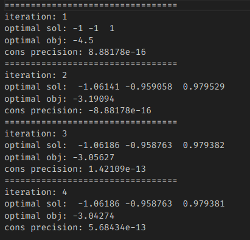
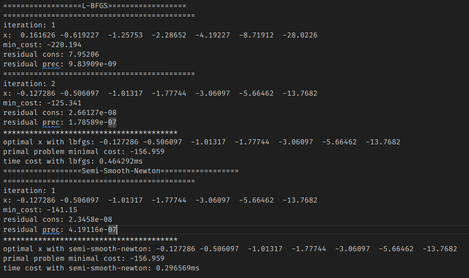

## Task1

已知凸问题
$$
\begin{array}{cl}
\min & f(x) \\
\text { s.t. } & g(x) \leq 0 \\
& h(x)=0
\end{array}
$$

即 $f(x),g(x),h(x)$ 均为 x 的凸函数，又 max和平方操作能够保持原函数的凸性，所以 PHR 增广拉格朗日函数也为凸函数
$$
\mathcal{L}_{\rho}(x, \lambda, \mu):=f(x)+\frac{\rho}{2}\left\{\left\|h(x)+\frac{\lambda}{\rho}\right\|^{2}+\left\|\max \left[g(x)+\frac{\mu}{\rho}, 0\right]\right\|^{2}\right\}
$$


## Task 2

原问题：
$$
\min L(x)=\frac{1}{2} x^{T} M_{Q} x+c_{Q}^{T} x
$$
由于$M_{Q}$是半正定的，因此原问题是非严格凸的，使用近似点算法（Proximal Point Algorithm，PPA）进行迭代：
$$
x^{k+1}\leftarrow prox_{\frac{1}{\rho},L}(x^{k})=\mathop{\arg\min}\limits_{x}L(x)+\frac{1}{2\rho}\left \| x-x^{k} \right \|^{2}
$$

$$
x^{k+1} =\mathop{\arg\min}\limits_{x} \frac{1}{2} x^{T}\left(M_{Q}+\frac{1}{\rho} I\right) x+\left(c_{Q}-\frac{1}{\rho} x^{k}\right)^{T} x
$$

该问题是Low-Dim strictly convex QP problem：

```cpp
 	constexpr double eps = 1e-5;
    constexpr int max_iterations = 50;
    Eigen::MatrixXd Identity_3 = Eigen::MatrixXd::Identity(3, 3);

    double rho = 1.0, tol = 1;
    int iteration = 0;

    while (tol > eps && iteration <= max_iterations) {
        ++iteration;
        Q_prox = Q + 1.0 / rho * Identity_3;
        c_prox = c -  1.0 / rho * x_hat;
        double minobj = sdqp::sdqp<3>(Q_prox, c_prox, A, b, x);
        std::cout << "=================================" << std::endl;
        std::cout << "iteration: " << iteration << endl;
        std::cout << "optimal sol: " << x.transpose() << std::endl;
        std::cout << "optimal obj: " << minobj << std::endl;
        std::cout << "cons precision: " << (A * x - b).maxCoeff() << std::endl;
        tol = (x - x_hat).norm() / std::max(1.0, x.norm());
        rho = std::min(rho * 10, 1e6);
        x_hat = x;
    }
```

### Result:



## Task 3

原问题：
$$
\begin{aligned}\min_{a,b,c,d,e,f,g\in\mathbb{R}}&a+2b+3c+4d+5e+6f+7g\\\mathrm{s.t.}&\|(7a+1,6b+3,5c+5,4d+7,3e+9,2f+11,g+13)\|\leq a+1\end{aligned}
$$
等价于：
$$
\min f^{T}x\\s.t.||Ax+b||\leq c^{T}x+d
$$
其中：
$$
\begin{aligned}
&x\leftarrow[a,b,c,d,e,f,g] \\
&A=diag(7,6,5,4,3,2,1) \\
&b=[1,3,5,7,9,11,13]^T \\
&c=[1,0,0,0,0,0,0]^T \\
&d=1 \\
&f=[1,2,3,4,5,6,7]^T
\end{aligned}
$$
该问题属于SOCP问题，通过仿射变换得到：
$$
\min f^{T}x\\s.t.\binom{c^\mathrm{T}x+d}{Ax+b}\in\mathcal{Q}^n
$$
令
$$
\bar{A}=[c^{T};A] \\
\bar{b} = [d; b]
$$
则：
$$
\begin{aligned}&\min_{x,s}f^\mathrm{T}x\\&\mathrm{s.t.} \bar{A}x+\bar{b}=s\circ s\end{aligned}
$$
增广拉格朗日对偶函数为：
$$
\mathcal{L}_{\rho}(x,s,\mu):=f^{\mathrm{T}}x++\frac{\rho}{2}\Big\|\bar{A}x+\bar{b}-s\circ s+\frac{\mu}{\rho}\Big\|^{2}
$$
又因为：
$$
\operatorname*{min}_{s}\left\|v-s\circ s\right\|^2=\left\|P_{\mathcal{K}}(-v)\right\|^2
$$
ALM迭代为：
$$
\begin{aligned}
&\mathcal{L}_{\rho}(x,\mu):=f^{\mathrm{T}}x+\Big\|P_{\mathcal{K}}\Big(\frac{\mu}{\rho}-\bar{A}x-\bar{b}\Big)\Big\|^{2}\Big\} \\
&x^{k+1}\leftarrow \mathop{\arg\min}\limits_{x}\mathcal{L}_{\rho}(x,\mu^{k})\\
&\mu^{k +1}\leftarrow P_{\mathcal{K}}\big(\mu^{k}-\rho(\bar{A}x^{k+1}+\bar{b})\big) \\
&\rho\leftarrow\min[(1+\gamma)\rho,\beta]\end{aligned}
$$
对于第一步迭代，有两种方法：

###  L-BFGS

```cpp
			std::cout << "==================L-BFGS==================" << std::endl;
            // l-bfgs parameters
            lbfgs::lbfgs_parameter_t lbfgs_params;
            lbfgs_params.mem_size = 16;
            lbfgs_params.past = 0;
            lbfgs_params.g_epsilon = 0.0;
            lbfgs_params.min_step = 1e-32;
            lbfgs_params.delta = 1e-4;

            while ((res_cons > eps_cons || res_prec > eps_prec) && iteration <= max_iterations)
            {
                ++iteration;

                double min_cost = 0.0;

                // l-bfgs optimization
                lbfgs::lbfgs_optimize(x_opt, min_cost, &CostFunction, nullptr, this, lbfgs_params);
                // calculate residual
                Eigen::VectorXd v = mu_ / rho_ - A_hat_ * x_opt - b_hat_;
                Eigen::VectorXd proj = Project2Soc(v);
                Eigen::VectorXd g = f_ - rho_ * A_hat_.transpose() * proj;
                Eigen::VectorXd p = mu_ / rho_ - proj;

                res_cons = p.lpNorm<Eigen::Infinity>();
                res_prec = g.lpNorm<Eigen::Infinity>();
                // update dual variables
                mu_ = Project2Soc(mu_ - rho_ * (A_hat_ * x_opt + b_hat_));
                rho_ = std::min((1 + gamma_) * rho_, beta_);

                // print iteration info
                std::cout << "============================================" << std::endl;
                std::cout << "iteration: " << iteration << std::endl;
                std::cout << "x: " << x_opt.transpose() << std::endl;
                std::cout << "min_cost: " << min_cost << std::endl;
                std::cout << "residual cons: " << res_cons << std::endl;
                std::cout << "residual prec: " << res_prec << std::endl;
            }
```

CostFunction为：

```cpp
inline static double CostFunction(void *instance, const Eigen::VectorXd &x,
                                      Eigen::VectorXd &g)
{
    SOCP_ALM &obj = *(SOCP_ALM *)instance;
    g = obj.CalculateGradient(x);
    double cost = obj.CalculateCost(x);
    return cost;
}
```

CalculateCost:

```cpp
inline double CalculateCost(const Eigen::VectorXd &x)
{
    Eigen::VectorXd v = mu_ / rho_ - A_hat_ * x - b_hat_;
    Eigen::VectorXd proj = Project2Soc(v);
    double cost = f_.dot(x) + rho_ * proj.squaredNorm() / 2;
    return cost;
}
```

CalculateGradient:

```cpp
inline Eigen::VectorXd CalculateGradient(const Eigen::VectorXd &x)
{
    Eigen::VectorXd v = mu_ / rho_ - A_hat_ * x - b_hat_;
    Eigen::VectorXd proj = Project2Soc(v);
    Eigen::VectorXd g = f_ - rho_ * A_hat_.transpose() * proj;
    return g;
}
```

其中投影函数为
$$
\left.P_{\mathcal{K}=\mathcal{Q}^{n}}(v)=\left\{\begin{array}{ll}{0,}&{{v_{0}\leq-\|v_{1}\|_{2}}}\\{{\frac{v_{0}+\|v_{1}\|_{2}}{2\|v_{1}\|_{2}}\big(\|v_{1}\|_{2},v_{1}\big)^{\mathrm{T}},}}&{{|v_{0}|<\|v_{1}\|_{2}}}\\{v,}&{{v_{0}\geq\|v_{1}\|_{2}}}\end{array}\right.\right.
$$


Project2Soc：

```cpp
inline Eigen::VectorXd Project2Soc(const Eigen::VectorXd &v)
{
    const double v0 = v(0);
    const Eigen::VectorXd v1 = v.segment(1, m_);
    const double v1_norm = v1.norm();
    Eigen::VectorXd proj_v = Eigen::VectorXd::Zero(m_ + 1);
    if (v0 <= -v1_norm)
    {
        proj_v = Eigen::VectorXd::Zero(m_ + 1);
    }
    else if (v0 >= v1_norm)
    {
        proj_v = v;
    }
    else
    {
        double coeff = (v0 + v1_norm) / (2 * v1_norm);
        proj_v << v1_norm, v1;
        proj_v *= coeff;
    }
    return proj_v;
}
```

### Semi-Smooth-Newton Method

```cpp
			std::cout << "==================Semi-Smooth-Newton==================" << std::endl;
            while ((res_cons > eps_cons || res_prec > eps_prec) && iteration <= max_iterations)
            {
                ++iteration;

                double min_cost = 0.0;

                // semi-smooth-newton optimization
                SemiSmoothNewtonMethod(x_opt, min_cost);
                // calculate residual
                Eigen::VectorXd v = mu_ / rho_ - A_hat_ * x_opt - b_hat_;
                Eigen::VectorXd proj = Project2Soc(v);
                Eigen::VectorXd g = f_ - rho_ * A_hat_.transpose() * proj;
                Eigen::VectorXd p = mu_ / rho_ - proj;

                res_cons = p.lpNorm<Eigen::Infinity>();
                res_prec = g.lpNorm<Eigen::Infinity>();
                // update dual variables
                mu_ = Project2Soc(mu_ - rho_ * (A_hat_ * x_opt + b_hat_));
                rho_ = std::min((1 + gamma_) * rho_, beta_);

                // print iteration info
                std::cout << "============================================" << std::endl;
                std::cout << "iteration: " << iteration << std::endl;
                std::cout << "x: " << x_opt.transpose() << std::endl;
                std::cout << "min_cost: " << min_cost << std::endl;
                std::cout << "residual cons: " << res_cons << std::endl;
                std::cout << "residual prec: " << res_prec << std::endl;
            }
```

SemiSmoothNewtonMethod:

```cpp
inline void SemiSmoothNewtonMethod(Eigen::VectorXd &x, double &cost)
{
    const double eps = 1e-5;
    const double c = 1e-4;        //Armijo condition c
    auto g = CalculateGradient(x);
    const Eigen::MatrixXd identity_N = Eigen::MatrixXd::Identity(N_, N_);
    while (g.norm() >= eps)
    {
        auto prox_hessian = CalculateProximateHessian(x);
        auto direction = -prox_hessian.inverse() * g;
        double step = 1.0;
        double f = CalculateCost(x);
        while (CalculateCost(x + step * direction) > f + c * step * direction.dot(g))
        {
            step = 0.5 * step;
        }
        x = x + step * direction;
        g = CalculateGradient(x);
    }
    cost = CalculateCost(x);
}
```

在牛顿法的基础上，考虑到不光滑的情况，Hessian矩阵用$\partial_{B}\nabla_{x}\mathcal{L_{\rho}}$近似：

CalculateProximateHessian:

```cpp
inline Eigen::MatrixXd CalculateProximateHessian(const Eigen::VectorXd &x)
{
    auto grad_project2soc = CalculateBDifferentialOfProject(mu_ - rho_ * (A_hat_ * x + b_hat_));
    Eigen::MatrixXd prox_hessian = rho_ * A_hat_.transpose() * grad_project2soc * A_hat_;
    return prox_hessian;
}
```

CalculateBDifferentialOfProject:
$$
\partial_BP_{\mathcal K}(x)\ni\begin{cases}I_n&\|x_2\|\leq x_1,\\0&\|x_2\|\leq-x_1,\\\left(\begin{array}{cc}\frac{1}{2}&\frac{x_2^\mathrm{T}}{2\|x_2\|}\\\frac{x_2}{2\|x_2\|}&\frac{x_1+\|x_2\|}{2\|x_2\|}I_{n-1}-\frac{x_1x_2x_2^\mathrm{T}}{2\|x_2\|^3}\end{array}\right)&\|x_2\|>|x_1|.\end{cases}
$$

```cpp
inline Eigen::MatrixXd CalculateBDifferentialOfProject(const Eigen::VectorXd &v)
{
        const double v0 = v(0);
        const Eigen::VectorXd v1 = v.segment(1, m_);
        const double v1_norm = v1.norm();
        Eigen::MatrixXd b_differential(m_ + 1, m_ + 1);
        if (v0 <= -v1_norm)
        {
            b_differential = Eigen::MatrixXd::Zero(m_ + 1, m_ + 1);
        }
        else if (v0 >= v1_norm)
        {
            b_differential = Eigen::MatrixXd::Identity(m_ + 1, m_ + 1);
        }
        else
        {
            auto top_left = b_differential.block(0, 0, 1, 1);
            auto top_right = b_differential.block(0, 1, 1, m_);
            auto bottom_left = b_differential.block(1, 0, m_, 1);
            auto bottom_right = b_differential.block(1, 1, m_, m_);

            top_left << 0.5;
            top_right << v1.transpose() / v1_norm / 2;
            bottom_left << v1 / v1_norm / 2;
            bottom_right << -v0 * v1 * v1.transpose() / std::pow(v1_norm, 3) / 2 
                            + (v0 + v1_norm) / v1_norm / 2 * Eigen::MatrixXd::Identity(m_, m_);
        }

        return b_differential;
}
```

### Result



可以看出相比L-BFGS方法，Semi-Smooth-Newton Method收敛更快